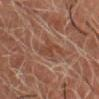
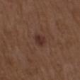
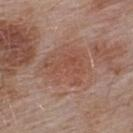

 # Skin Cancer Detection — Friendly Demo & Guide 🩺✨

> A small, fun, and practical skin lesion classifier built with PyTorch.

This repository contains code, models, and sample data from the ISIC collection configured to train and evaluate three CNN backbones (ResNet, DenseNet, EfficientNet) for binary skin lesion classification (`malignant` vs `benign`). The README below will get you started quickly and show example images from the dataset to make things visual and fun.

---

## Quick look — Gallery
Here's a tiny gallery of real examples included in `data/final_subset_images`:

<p float="left">
  
  
  
</p>

_Images: sample lesions from the dataset — open them and explore!_

---

## Highlights
- Clean project structure for experiments (train / test / models)
- Ready-to-run training scripts for three backbones: `ResNet`, `DenseNet`, `EfficientNet`
- Built-in evaluation script that loads saved weights and prints classification reports
- Augmentation pipeline and careful preprocessing in `src/*/dataset.py`

---

## Quick Start (Windows & Linux)

1. Create & activate a virtual environment

Windows (PowerShell):

```powershell
python -m venv venv
.\venv\Scripts\Activate.ps1
```

macOS / Linux:

```bash
python3 -m venv venv
source venv/bin/activate
```

2. Install dependencies

```bash
pip install -r requirements.txt
```

3. Train a model (example: DenseNet)

```bash
python src/DenseNet/train.py
```

Replace `src/DenseNet/train.py` with `src/EfficentNet/train.py` or `src/ResNet/train.py` to try the other backbones.

4. Evaluate saved models on the provided test CSV

```bash
python src/evaluate_unprocessed.py
```

This script will try to load the weights in `models/` and run a classification report on `data/test/test_labels.csv` using images in `data/final_subset_images`.

---

## What’s in the repo (short guide)
- `data/` — dataset files and images (CSV metadata, train/test images)
  - `final_train/` — images + `final_train_labels.csv` used for training
  - `final_subset_images/` — curated subset used for unprocessed evaluation/demo
  - `test/` — `test_labels.csv` (used by `evaluate_unprocessed.py`)
- `src/` — model code and pipelines
  - `DenseNet/`, `EfficentNet/`, `ResNet/` — each has `dataset.py`, `model.py`, `train.py`, `train_evaluate.py`, `test_evaluate.py`
- `models/` — trained weights are saved here (examples: `best_DenseNet_model.pth`, `best_EffecientNet_model.pth`, `best_model.pth`)
- `Preprocessing/` — augmentation and preprocessing utilities
- `requirements.txt` — Python packages used (torch, torchvision, pandas, numpy, opencv-python, scikit-learn, matplotlib)

---

## Data format & quick notes
- CSV rows use `isic_id` and `malignant` (0/1) columns. The dataset reader builds image paths like `isic_id + ".jpg"`.
- Example CSV header (from `data/final_train/final_train_labels.csv`):

```
isic_id,malignant,attribution,copyright_license,lesion_id,...
```

- `src/*/dataset.py` contains training augmentations (random flips, rotations, color jitter) and validation transforms (resize + normalize).

---

## How training works (high level)
1. The training script reads `data/final_train/final_train_labels.csv` and performs a stratified split into `train_temp.csv` and `val_temp.csv`.
2. `SkinDataset` reads `isic_id` values and loads images from the configured image folder.
3. Models are built from torchvision pretrained backbones and the final classifier is replaced for binary output.
4. Training uses `BCEWithLogitsLoss` with a `pos_weight` to partially address class imbalance.

---

## Evaluation & inference
- Use `python src/evaluate_unprocessed.py` to run all saved models and print classification reports.
- If you want to run inference on a single image, adapt `src/evaluate_unprocessed.py`:

```python
# minimal pseudo-example (adapt from evaluate_unprocessed.py)
from src.DenseNet.model import build_model
import torch, cv2
model = build_model()
model.load_state_dict(torch.load('models/best_DenseNet_model.pth', map_location='cpu'))
model.eval()
img = cv2.imread('data/final_subset_images/ISIC_0081966.jpg')
# apply same transform as dataset (resize, normalize)
# run model and apply sigmoid to get probability
```

---

## Tips & notes
- If training is unstable, try lowering the learning rate or unfreezing more backbone layers.
- Scripts already use `pos_weight=torch.tensor([2.0])` to bias the loss toward the minority (malignant) class — you can tune this.
- For reproducible splits: `train_test_split(..., random_state=42)` is already used.

---

## License & Attribution
The repository contains public ISIC data. Please review `data/ISIC_2024_Permissive_Training_Input/ATTRIBUTION.txt` and `LICENSE.txt` for dataset-specific licensing and attribution requirements.

---

## Want more?
- I can add a polished single-image inference script with CLI.
- I can add a Jupyter demo notebook that shows model predictions next to images and interactive sliders.

If you want either, say which (notebook or single-image CLI) and I’ll add it next.

---

Thanks for using this repo — explore the image gallery, try training a model, and have fun! 🎉
